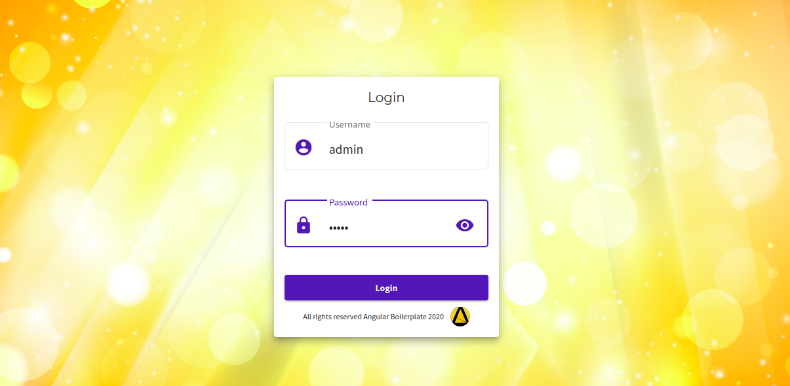

# Angular 7, Ngxs and Angular Material Starter

This project is a clean starter for your projects, use it to build bigger and better architectured projects with your prefered style
it uses the mix of [NGXS](https://www.ngxs.io) and [Angular Material](https://material.angular.io/) and the magic of clean code :).
it was generated with [Angular CLI](https://github.com/angular/angular-cli) version 7.0.5.

## Getting started

`git clone https://github.com/oauthentik/ngsx-material-starter.git new-project && cd new-project && ng serve`

## Dependencies

This Starter project is based on the packages:

- Angular 7.x.x
- Angular Material 7.x.x
- Angular flex layout 7.0.0
- Ngxs 3.6.x (with it's Forms, Storage, Router and ReduxDevTools plugins)
- Ngx Mat Select Search 1.8.x
  NB: Having to upgrade your angular to a major version may have some issues

## Theming

No additional css frameworks are added to this project. and i prefer to keeps things clean better than stuffed (large build size nightmare)
I used the Sass variables in the theme folder to specify some of the apearence in the Angular material.
other styles are specified in the styles.scss file.

## Configurations

In addition to the production flag in the Environment file i added
i added the attributes below:
`api: { host: 'http://localhost:3000', url: 'http://localhost:3000/api' }, appLogo: 'assets/logo.svg', appBackground: 'assets/imgs/bg.jpg', appLoginBackground: 'assets/imgs/login-bg.jpg', appName: "Angular Boilerplate"`
So change it to your real values

## Upcoming Improvments

1. Adding a material table enhanced library for less code (MatDatatable (Using the same Mat Table but with more features: Advanced column filtering, Interfacing columns, Decorators, configurations... ))
2. Adding a navigation dialog strategy (Dialogs with routes)
3. Adding a beautifull generic dashboards
4. More control

## Licence

Apache 2
